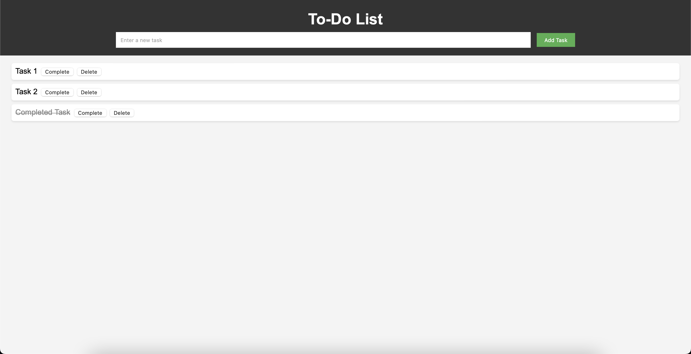

# To-Do List Web Application

A simple web application for managing tasks, built with JavaScript.


## Table of Contents

- [Introduction](#introduction)
- [Features](#features)
- [Getting Started](#getting-started)
  - [Prerequisites](#prerequisites)
  - [Installation](#installation)
- [Usage](#usage)
- [Project Structure](#project-structure)
- [Contributing](#contributing)

## Introduction

The To-Do List Web Application is a straightforward task management tool developed using JavaScript. It allows users to add, complete, and delete tasks easily. This README provides an overview of the project, its features, and instructions for setting it up and running it on your local machine.

## Features

- Add tasks to your to-do list.
- Mark tasks as completed.
- Delete tasks you no longer need.
- Tasks are stored in local storage, so your data persists even after refreshing the page.

## Getting Started

### Prerequisites

Before you begin, ensure you have met the following requirements:

- Modern web browser (e.g., Google Chrome, Mozilla Firefox)
- [Node.js](https://nodejs.org/) and npm (Node Package Manager) installed (for running a local development server, optional)

### Installation

1. Clone the repository to your local machine:

   ```bash
   git clone https://github.com/your-username/to-do-list-app.git
   ```

2. Change to the project directory:

   ```bash
   cd to-do-list-app
   ```

3. If you're using a local development server, you can start it with:

   ```bash
   npm install
   npm start
   ```

If you're not using a local server, you can simply open index.html in your web browser.

## Usage

- To add a task, enter the task description in the input field and click the "Add Task" button.
- To mark a task as completed, click the "Complete" button next to the task. The task's appearance will change to indicate completion.
- To delete a task, click the "Delete" button next to the task.
- Tasks are automatically saved to your browser's local storage, so you won't lose your tasks even if you close the browser or refresh the page.

## Project Structure

The project is structured as follows:

- `index.html`: The main HTML file for the application.
- `style.css`: The CSS file for styling the application.
- `script.js`: The JavaScript file containing the application logic.

## Contributing

Contributions are welcome! If you'd like to contribute to this project, please follow these steps:

1. Fork the repository.
2. Create a new branch for your feature or bug fix: `git checkout -b feature/new-feature`
3. Make your changes and commit them: `git commit -m 'Add new feature'`
4. Push to the branch: `git push origin feature/new-feature`
5. Submit a pull request.
